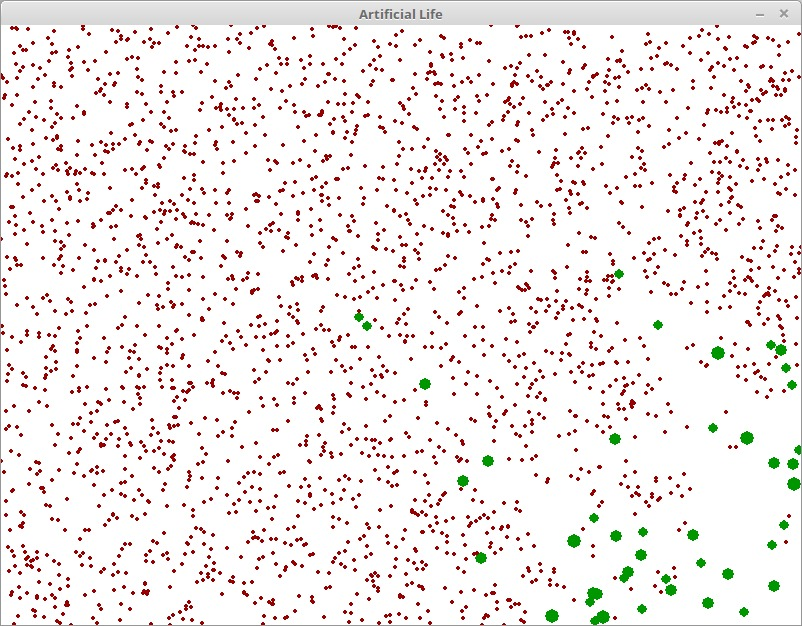

# artificial-life

This project simulates a bacteria colony, it starts with one bacterium and a lot of food in the area. The bacterium grows as it eats food and it can reproduce when it achieves one size. The food grows naturally as well.

